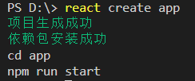

# react-cli
react开发脚手架，支持项目初始化、本地开发、打包功能。

全局安装脚手架：
```
npm i react-fe-cli
```
查看版本：
```
react -V
```
项目初始化，新建appName项目：
```
react create appName
```


切换到项目目录下:
```
cd appName
```
本地开发模式：
```
npm run start
```
本地打包：
```
npm run build
```